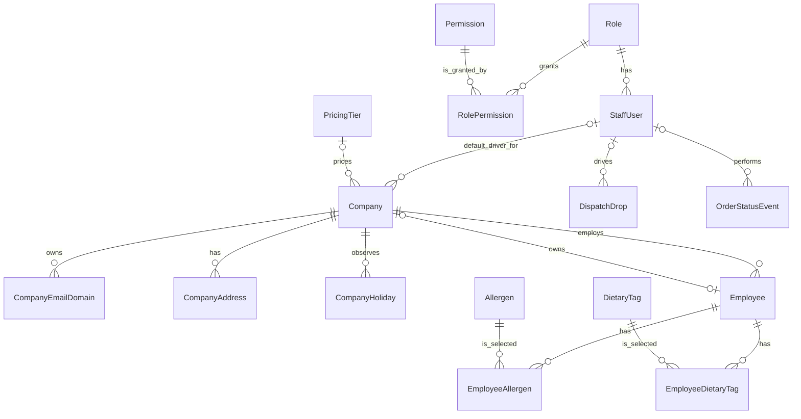
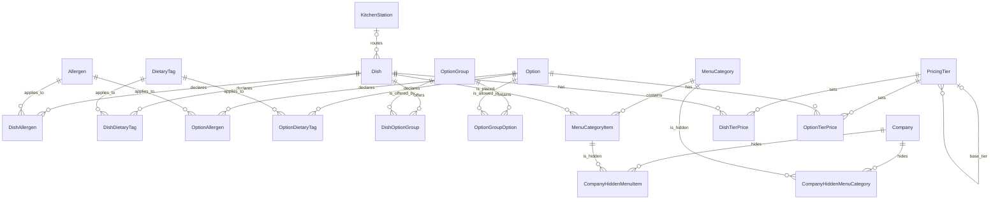
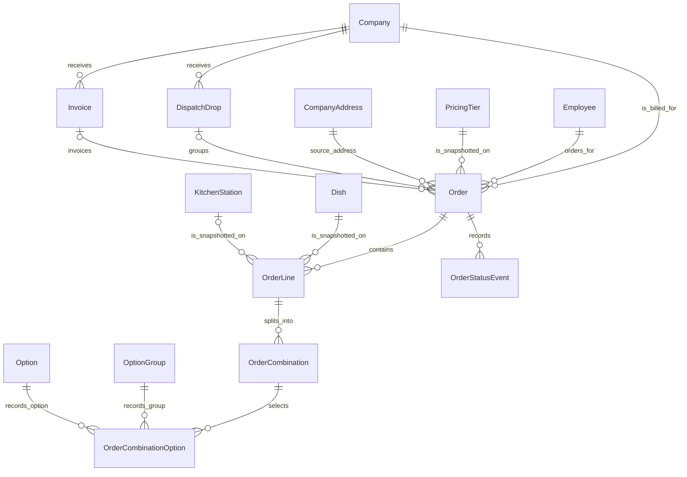

# Fernleaf Kitchen Operations Admin Panel

Fernleaf Kitchen runs corporate meal programmes. Companies have employees, employees receive individual boxed meals for particular delivery dates, and each company is billed for its orders. This application gives the kitchen's own staff one internal place to manage that work.

This is an **internal staff application**, not a customer-facing ordering application. Staff create orders on behalf of employees and take them through the operational flow. The required stack is Next.js, NestJS, Prisma, and PostgreSQL.

## Live Application

- Frontend: <https://fernleaf-kitchen-admin.vercel.app>
- Repository: <https://github.com/henil-suchak/fernleaf-kitchen-admin>

| Role | Email | Password |
| --- | --- | --- |
| Admin | `admin@test.com` | `Test@1234` |
| Kitchen | `kitchen@test.com` | `Test@1234` |
| Dispatch | `dispatch@test.com` | `Test@1234` |
| Driver | `driver@test.com` | `Test@1234` |

For a reviewer deployment, I set `SEED_STAFF_PASSWORD=Test@1234` only while deliberately running the seed. The password is not committed to the repository.

## Architecture

```text
Browser
  |
  | HTTPS / JSON / HttpOnly session cookie
  v
Next.js frontend (apps/web)
  |
  | HTTP / JSON only
  v
NestJS API (apps/api)
  |
  v
Prisma Client
  |
  v
PostgreSQL
```

The frontend owns UI, forms, API calls, role-aware navigation, and displaying errors. The NestJS API owns authentication, authorization, validation, business rules, transactions, and persistence. PostgreSQL stores the relational data, constraints, and historical records.

Business logic stays in NestJS. The browser never talks to Prisma or PostgreSQL, and there are no Next.js server actions that bypass the API.

## Repository Structure - Why I Used a Single Repository

```text
apps/
  web/                  Next.js staff application
  api/                  NestJS API and Prisma schema
packages/
  contracts/            Small transport-only TypeScript contracts
```

I used npm workspaces because the frontend and backend are one product and usually change together. For a 48-hour assignment, one clone, one install, and commits containing matching API and UI work were easier to reason about. The small contracts package can be shared without exposing Prisma-generated types to the browser.

This is a plain npm-workspaces monorepo; it does not use Nx or Turborepo. The web and API workspaces still build and start independently, so they can be deployed separately. For a much larger organisation with separate teams and release cycles, separate repositories could be reasonable.

# Data Model

The source of truth is [apps/api/prisma/schema.prisma](apps/api/prisma/schema.prisma). The committed migrations in [apps/api/prisma/migrations](apps/api/prisma/migrations) create this model incrementally.

### Model Dictionary

#### Identity and authorization

| Model | Why it exists |
| --- | --- |
| `StaffUser` | An internal Fernleaf user who can sign in. |
| `Role` | A staff responsibility such as Admin, Kitchen, Dispatch, or Driver. |
| `Permission` | A specific server capability, such as `ORDER_EDIT`. |
| `RolePermission` | The join table that grants permissions to roles. |

#### Kitchen settings and reference data

| Model | Why it exists |
| --- | --- |
| `KitchenSettings` | The one global kitchen timezone, working days, and cutoff configuration. |
| `KitchenHoliday` | A kitchen closure date skipped by cutoff calculation. |
| `Allergen` | An admin-managed allergen reference value. |
| `DietaryTag` | An admin-managed dietary preference reference value. |
| `KitchenStation` | A preparation-routing destination for dishes. |

#### Catalogue

| Model | Why it exists |
| --- | --- |
| `Dish` | A sellable dish with SKU, cost, temperature, minimum quantity, and optional station. |
| `Option` | A reusable selectable addition such as rice or sauce. |
| `OptionGroup` | A reusable group of allowed options. |
| `DishOptionGroup` | Links a dish to an option group with required state and display order. |
| `OptionGroupOption` | Links a group to its allowed options and their order. |
| `DishAllergen` | Links a dish to an allergen. |
| `DishDietaryTag` | Links a dish to a dietary tag. |
| `OptionAllergen` | Links an option to an allergen. |
| `OptionDietaryTag` | Links an option to a dietary tag. |

#### Pricing

| Model | Why it exists |
| --- | --- |
| `PricingTier` | A named manual or derived pricing policy. |
| `DishTierPrice` | An explicit dish price or override in one tier. |
| `OptionTierPrice` | An explicit option price or override in one tier. |

#### Companies and employees

| Model | Why it exists |
| --- | --- |
| `Company` | A corporate customer with billing, calendar, delivery, pricing, driver, and owner defaults. |
| `CompanyEmailDomain` | A company-owned email domain, globally unique. |
| `CompanyAddress` | A delivery address belonging to a company. |
| `CompanyHoliday` | A date when one company cannot receive deliveries. |
| `Employee` | A corporate customer belonging to exactly one company. |
| `EmployeeAllergen` | Links an employee to an allergen. |
| `EmployeeDietaryTag` | Links an employee to a dietary preference. |

#### Menu

| Model | Why it exists |
| --- | --- |
| `MenuCategory` | An ordered menu grouping, including a secret flag. |
| `MenuCategoryItem` | An ordered placement of a dish in a category. |
| `CompanyHiddenMenuCategory` | Hides a category from one company. |
| `CompanyHiddenMenuItem` | Hides an individual menu placement from one company. |

#### Orders, fulfilment, and billing

| Model | Why it exists |
| --- | --- |
| `Order` | The operational order, delivery snapshot, price-tier snapshot, status, and total. |
| `OrderLine` | A dish within an order, including dish and station snapshots. |
| `OrderCombination` | One distinct set of selected options; the kitchen prep unit. |
| `OrderCombinationOption` | A selected option, with historical names and price. |
| `OrderStatusEvent` | The order transition timeline and optional staff actor. |
| `DispatchDrop` | A grouped delivery operation for matching confirmed orders. |
| `Invoice` | A frozen internal financial record for a company's orders. |

### Model Relationships

**Identity.** One `Role` has many staff users. `Role` and `Permission` are many-to-many through `RolePermission`. A staff user may be a company's default driver, drive many drops, and act on many order events.

**Companies and employees.** One company has many domains, addresses, holidays, employees, orders, drops, and invoices. An employee belongs to exactly one company. A company has zero or one owner through `ownerEmployeeId`; because that field is unique, an employee can own at most one company. Employee allergens and dietary tags use explicit join tables.

**Catalogue and menu.** A dish has an optional kitchen station, many allergens, dietary tags, and option groups through `DishOptionGroup`. An option group has many allowed options through `OptionGroupOption`. A dish is placed in categories through `MenuCategoryItem`; companies can hide a category or a placement.

**Pricing.** A company has an optional price tier, otherwise the active default tier applies. A tier can have one manual base tier and many derived tiers. Dishes and options have tier prices through `DishTierPrice` and `OptionTierPrice`.

**Orders.** An order belongs to one employee, company, effective tier, and source address. It has many lines, each line has many combinations, and each combination has at most one option per option group through `OrderCombinationOption`. An order also has many status events and may have one drop and one invoice.

**Dispatch and billing.** A drop belongs to one company, has an optional assigned staff driver, and groups many orders. An invoice belongs to one company and has many orders; an order can be on at most one invoice.

### ER Diagrams

The diagrams are split to keep the relationships readable.







`KitchenSettings` and `KitchenHoliday` are not attached to a company or an order because they represent the single kitchen-wide calendar that services use for cutoffs and operational dates.

### Important Data-Modelling Decisions

- **Staff users and customer employees are separate.** Internal access control and customer data are different concerns.
- **Roles and permissions are separate.** Roles group permissions; `RolePermission` lets a future role be assembled without controller role-name checks.
- **Relationships are joins, not JSON arrays.** This protects uniqueness, ordering, filtering, and relational integrity.
- **Orders keep snapshots.** Changing a dish, option, tier, address, or station later must not rewrite an old order.
- **A combination is a prep unit.** Six brown-rice bowls and four jeera-rice bowls in one line become two actionable kitchen units.
- **Records are deactivated rather than deleted.** Existing relations and history remain readable.
- **Money is stored in integer minor units.** This avoids floating-point money errors.
- **Company and kitchen calendars have different jobs.** A company calendar blocks deliveries; only the kitchen calendar moves cutoff calculation.

## Roles, Authentication, and Authorization

The seed creates Admin, Kitchen, Dispatch, and Driver roles. Each `StaffUser` has exactly one role. There is no public signup because this is an internal application; Administrators create staff accounts and assign roles.

Login verifies a bcrypt hash, signs a JWT containing only the staff-user ID, and returns it in the `fernleaf_session` HttpOnly cookie. The frontend restores a session through `GET /api/auth/me` and does not store the token in browser storage. `JwtAuthGuard` verifies the token and reloads the current active staff user from PostgreSQL, so deactivation takes effect on the next protected request.

Controllers use `JwtAuthGuard`, `PermissionsGuard`, and `@RequirePermissions(...)`. The permission guard reads current `Role -> RolePermission -> Permission` data from PostgreSQL rather than trusting permissions embedded in the JWT. The frontend hides irrelevant screens for usability, but backend permission checks are the actual security boundary.

## Main Business Flow

```text
Catalogue
  -> Pricing tiers
  -> Company and employee
  -> Employee-specific menu
  -> Draft or placed order
  -> Manual cutoff processing
  -> Confirmed kitchen prep units
  -> Dispatch drop and driver delivery
  -> Invoice and paid status
```

The employee menu applies company pricing and visibility rules. The order service validates those rules again before saving. Confirmed combinations appear on the kitchen board, ready orders become grouped dispatch drops, drivers record delivery, and confirmed/delivered uninvoiced orders can be grouped into an internal invoice.

## Key Business Rules Implemented

### Catalogue and menu

- Dishes, options, groups, reference data, categories, and placements support active/inactive state. New configuration requires active references; old relations remain readable.
- Dish option groups are ordered and required or optional. A combination can select one allowed option from each group, and required groups must be selected.
- A normal employee preview excludes inactive, unpriced, company-hidden, and secret categories. A visible secret category can be reached through its direct preview endpoint.
- A required group with no available options removes the dish from the orderable menu.

### Pricing

- One active manually priced tier is the default. A company may use another active tier, otherwise the default resolves.
- Explicit item prices win. A tier can derive from an active manually priced base tier (`BASE_TIER`) or item cost (`ITEM_COST`).
- An item without a usable price is unavailable, not displayed at zero.
- Derived prices use integer basis points, round up the division, then round up to the nearest five minor units. Overrides still win.

### Companies and employees

- Domains are lowercased, globally unique, and reject public domains such as `gmail.com`.
- An active company must retain an active address. Its tier and default driver must be active; a default driver needs both driver permissions.
- A company owner must be an active employee of that company and cannot own a second company.
- An employee belongs to one company, has delivery-preference flags, and can have allergies and dietary preferences.

### Orders and cutoff

- Statuses are `DRAFT`, `PLACED`, `CONFIRMED`, `DELIVERED`, `CANCELLED`, and `REJECTED`. Persisted transitions create `OrderStatusEvent` records.
- Draft and placed orders are editable before cutoff. A user with `ORDER_OVERRIDE` can cancel a confirmed order and change confirmed delivery details before delivery execution begins.
- Cutoff counts backwards over kitchen working days and kitchen holidays. Company holidays block delivery but do not move the cutoff.
- Manual cutoff processing is idempotent: eligible drafts cancel, eligible placed orders confirm, and expected-state updates prevent a second request advancing them again.
- A dish appears only once per order. Combination quantities must equal line quantity, required groups must be selected, invalid options and duplicate combinations are rejected.

### Kitchen and dispatch

- The kitchen board contains confirmed orders only. Each `OrderCombination` is one unit and uses the dish's snapshotted station or Unassigned.
- Starting or completing twice returns a conflict. Completing an unstarted unit sets both timestamps. An Admin can force-complete remaining confirmed units.
- Planned dispatch-ready time is delivery time minus the snapshotted company lead time; planned kitchen-ready is another 30 minutes earlier. Incomplete work is late after that time and at risk during the preceding 30-minute window.
- Dispatch groups confirmed orders by normalized company, date, exact delivery time, and historical address. A drop needs all orders kitchen-ready before dispatch-ready and needs a delivery-capable driver before departure.
- A driver sees only their own kitchen-local-today drops and can mark only their own out-for-delivery drop delivered with optional note and photo URL. Delivery records on-time status and advances grouped confirmed orders to delivered.

### Billing

- Only confirmed or delivered, uninvoiced orders for one company can be invoiced.
- An order can be on at most one invoice. Creation calculates the integer total and conditionally attaches every selected order in a serializable transaction.
- An open invoice can be marked paid once.

## Concurrency Handling

I used database controls instead of Redis or a generic lock service, which would add infrastructure without helping this assignment.

- Order, billing, kitchen, dispatch, and sensitive staff changes use Prisma transactions. Where competing actions matter, the services use serializable transactions and retry PostgreSQL serialization failures up to three times.
- State changes use expected-state `updateMany` conditions. For example, a kitchen start only succeeds while `kitchenStartedAt` is `null`; another simultaneous start changes zero rows and returns `409`.
- Invoice attachment checks company, eligible status, and `invoiceId: null` again during the update. If another invoice wins, the count is wrong and the transaction rolls back.
- The schema uses a partial unique index for one default tier plus composite keys and unique indexes for joins, domains, holidays, order-line dishes, and combinations.
- The final active Admin is protected inside a serializable staff-management transaction.

## Validation and Error Handling

`main.ts` configures a global NestJS `ValidationPipe` with `whitelist: true`, `forbidNonWhitelisted: true`, and `transform: true`. DTOs validate the HTTP shape: UUIDs, enums, dates, times, nested arrays, and ranges.

Validation is layered deliberately:

1. Frontend controls improve usability.
2. DTOs validate request shape.
3. Services validate business rules, such as valid dish options or active employees.
4. PostgreSQL constraints and transaction conditions protect final integrity.

For example, company domains are normalized and rejected if public, then protected by a unique database index. A tier must have valid derivation configuration, then the database protects the one-default-tier rule. Invoice creation validates selected orders and conditionally attaches them in one transaction.

The global exception filter returns status, error code, message, optional field details, path, and timestamp. The frontend API client reads those responses and displays actionable errors.

## Money and Pricing Correctness

Persisted amounts are integer minor units: `20000` represents INR 200.00. `sumMinorUnits` and `multiplyMinorUnits` validate safe non-negative integers. Derived prices use `BigInt` basis-point arithmetic rather than binary floating-point values.

The order service calculates a combination as dish price plus selected option prices, multiplied by that combination quantity. It sums combinations into a line and lines into an order. Billing sums order totals into an invoice. Tests cover direct, base-tier, cost-derived, override, missing-price, rounding, combination, and invoice-total cases.

## Timezone and Calendar Handling

The seeded kitchen timezone is **`Asia/Kolkata`**, stored as an IANA timezone in `KitchenSettings`. The backend treats delivery dates as calendar dates and uses Luxon to convert local cutoff date/time to a UTC instant.

Kitchen working days and `KitchenHoliday` rows determine cutoffs. `Company` working days and `CompanyHoliday` rows decide whether that company may receive a delivery but never change the cutoff. Backend dashboards and driver work resolve “today” in the kitchen timezone. The current frontend date input defaults from UTC; this small UI edge case is listed below.

## Historical Snapshots

An old order is evidence of what was purchased at the time, not a live catalogue lookup. `Order` snapshots the effective-tier name and delivery values. `OrderLine` snapshots dish name, SKU, and station. `OrderCombinationOption` snapshots option-group name, option name, and unit price. Persisted line and combination totals keep the resolved prices.

Changing a live dish, option, tier, address, or station later does not silently rewrite the old order or its kitchen history.

## Dashboards

Dashboard values come from [dashboard.service.ts](apps/api/src/dashboard/dashboard.service.ts), not hard-coded frontend numbers. Every dashboard date is the kitchen-local today label. Cancelled and rejected orders are excluded wherever a metric is defined over confirmed/delivered work.

### Admin Dashboard

- **Confirmed / delivered value:** sum of today's `Order.totalMinorUnits` for `CONFIRMED` and `DELIVERED` orders, invoiced or not.
- **Awaiting invoice:** the same statuses and date, additionally `invoiceId = null`.
- **Kitchen late / at risk:** confirmed orders whose combinations are incomplete after planned kitchen-ready, or within the 30 minutes before that target.
- **Orders by status:** all orders for today's delivery date, including cancelled/rejected, separated by status.
- **Drops by status:** drops containing at least one confirmed or delivered order.
- **Unassigned drops:** waiting/dispatch-ready drops without a driver.

I did not show taxes, forecasts, payment data, or prior-period charts because the model has none.

### Kitchen Dashboard

- **Prep units:** all combinations on today's confirmed orders, divided into total, not started, in progress, and completed from the two kitchen timestamps.
- **Late / at risk:** the same confirmed-order readiness rule used by Admin.
- **Station breakdown:** prep-unit counts grouped by snapshotted station, with missing station as Unassigned.

Draft, placed, cancelled, rejected, and delivered orders are not shown as kitchen work.

### Dispatch Dashboard

- **Drops by status:** today's operational drops containing confirmed or delivered orders.
- **Unassigned drivers:** waiting/dispatch-ready drops with no driver.
- **Delivery at risk:** non-delivered drops whose calculated delivery time is within 30 minutes.
- **Overdue:** non-delivered drops whose calculated delivery time has passed.

I did not add route optimisation because delivery zones and routing are outside the assignment.

### Driver Dashboard

- **Today's drops:** drops assigned to the authenticated driver today that contain confirmed or delivered work.
- **Remaining / delivered:** the same drops split by `DELIVERED` status.
- **On time:** delivered drops with `wasOnTime === true`.
- **Next delivery:** the first non-delivered assigned drop in delivery-time order, or `null` when none remain.

Other drivers' work, billing, and kitchen information are intentionally excluded.

## Testing

The API uses focused Node integration suites rather than claiming full UI coverage. They cover authorization, staff safety, common infrastructure, settings, reference data, catalogue, pricing, companies, employees, menu rules, orders, kitchen, dispatch, billing, and dashboards.

Important covered rules include permission changes applied to an existing JWT; money/time/pagination helpers; active catalogue relations; direct and derived pricing; company calendars and ownership; secret/company-hidden menus; order snapshots and cutoff; kitchen duplicate transitions; dispatch grouping and driver authorization; frozen invoices; and kitchen-timezone dashboard calculations.

After configuring a local PostgreSQL test database, run:

```bash
npm run lint
npm run typecheck
npm run build

npm run test:authorization --workspace=@fernleaf/api
npm run test:staff --workspace=@fernleaf/api
npm run test:common --workspace=@fernleaf/api
npm run test:settings --workspace=@fernleaf/api
npm run test:reference-data --workspace=@fernleaf/api
npm run test:catalogue --workspace=@fernleaf/api
npm run test:pricing --workspace=@fernleaf/api
npm run test:companies --workspace=@fernleaf/api
npm run test:employees --workspace=@fernleaf/api
npm run test:menu --workspace=@fernleaf/api
npm run test:orders --workspace=@fernleaf/api
npm run test:kitchen --workspace=@fernleaf/api
npm run test:dispatch --workspace=@fernleaf/api
npm run test:billing --workspace=@fernleaf/api
npm run test:dashboard --workspace=@fernleaf/api
```

# Decisions and Trade-offs

### Monorepo instead of separate repositories

I chose npm workspaces because web, API, and shared contracts are one assignment and evolve together. The trade-off is that separate teams and independent release cycles can eventually benefit from separate repositories.

### Modular NestJS application instead of microservices

I split the API into focused modules including Orders, Kitchen, Dispatch, Billing, and Settings. They share one database and one deployable API because that keeps transaction boundaries clear and setup small. Separate services would add complexity without helping this assignment.

### PostgreSQL instead of a document database

I chose PostgreSQL because the important data is relational: roles, employees, catalogue joins, orders, drops, and invoices. Constraints and transactions are useful parts of the business rules.

### Permission-based server authorization

I use permissions at endpoints instead of role-name checks throughout controllers. Roles still group responsibilities, but a future role can receive existing permissions without changing every endpoint.

### HttpOnly cookie authentication

The session JWT is in an HttpOnly cookie, so frontend JavaScript cannot read it. Credentialed CORS is restricted to `FRONTEND_URL`, and authenticated cross-origin mutations require an allowed origin. In production the cookie is `Secure` and `SameSite=None` for the separate frontend/API origins.

### Integer money, snapshots, and combinations

Integer money and `BigInt` derivation avoid floating-point errors. Order snapshots preserve history at the cost of intentional duplication. `OrderCombination` maps directly to the kitchen's real prep work rather than treating a whole dish line as one unit.

### Managed deployment using Vercel and Render

The frontend is on Vercel and the API/PostgreSQL deployment shape is Render plus Render PostgreSQL. This is simple for the assignment. The real trade-off is cross-site cookies: browser privacy settings can block a Vercel-to-Render session, so a same-site custom domain would be stronger long term.

# Prioritisation

## What I Built

I prioritised the internal workflow: permission-protected staff access; catalogue and pricing; companies and employees; employee-specific menus; order validation and snapshots; cutoff calculation and manual processing; kitchen preparation; dispatch and delivery; invoices; settings; dashboards; seed data; and focused integration tests.

## What I Skipped or Only Partially Completed

- **Portions and portion-size reference data [Should]:** not implemented. Groups select options directly and do not model size-based surcharges.
- **Employee CSV import [Should]:** not implemented. Employees are created individually.
- **Automatic cutoff scheduling [Must, partial]:** calculation plus manual, idempotent `POST /api/orders/cutoff/process` exist, but no background scheduler runs automatically when time passes.
- **Some required administration screens [Must, partial]:** the backend supports more company/address/owner/driver/calendar and menu-category/item management than the current frontend exposes. There is no create-company screen, and the menu screen does not edit/deactivate existing categories or placements.
- **Order-list and editor UX [Must, partial]:** the API supports pagination and company/date/status queries, but the UI lacks company/invoice filters and pagination controls. It does not show a live line/order total. The existing draft editor always resubmits food lines, so a delivery-only UI edit can re-resolve current prices; the API preserves prices when `lines` are omitted.
- **Dashboard landing [Must, partial]:** all four dashboard endpoints and a dashboard screen exist, but Kitchen, Dispatch, and Driver currently land directly in their workspace after login rather than their dashboard.
- **Demo-data breadth [Must, partial]:** seed data has the four roles, menu data, every order status, and today's driver fixture, but only two companies rather than several. Today's fixtures refresh only when the deliberate seed command runs.

Given the time limit, I chose to complete core rules and the main operational workflow rather than partly building portions, CSV import, a scheduler, and every remaining admin screen.

## What I Would Do Next

1. Finish partial Must work: automatic cutoff scheduling, complete company/menu/order-list UI, and fix the delivery-only draft editor request.
2. Make demo data review-safe on any day, with several companies and automatically refreshed current-day fixtures.
3. Add portions and CSV import with row-level errors.
4. Add pagination controls, measure a 400-order kitchen board, and make frontend navigation permission-driven rather than tied to four role codes.
5. Add login rate limiting, password reset, and a same-site production domain for a longer-lived product.

# Ambiguous Requirements and My Interpretation

### What happens after an invoice exists?

**My interpretation:** an invoice is a frozen financial snapshot. An authorised Admin can still cancel a confirmed invoiced order, but the invoice amount and relation do not change automatically.

**Why:** the assignment anticipates order changes but does not ask for refunds, credit notes, or accounting corrections.

### What is one kitchen prep unit?

**My interpretation:** one distinct `OrderCombination` is one prep unit, not a whole line or one individual meal.

**Why:** it contains the option selections and quantity the kitchen actually needs.

### What wins in derived pricing?

**My interpretation:** an explicit price in the current tier wins. Otherwise the tier derives from its configured base-tier price or item cost.

**Why:** staff get a fast default calculation and still have individual exceptions.

### What does a secret menu category mean?

**My interpretation:** it is omitted from normal employee preview but can be reached through direct category preview if otherwise visible.

**Why:** this implements “not listed but reachable” without a customer-facing route system.

### What can an Admin change after confirmation?

**My interpretation:** an Admin can override address, time, or packaging, and can cancel before delivery execution begins. Address/time changes are rejected once a drop is out for delivery or delivered.

**Why:** before departure the system can regroup a drop; after departure changing logistics would corrupt execution.

## Billing Behaviour After Invoicing

An invoice stores the fixed total calculated from selected orders at creation. It transactionally attaches only uninvoiced confirmed or delivered orders from the requested company. Later authorised cancellation of a confirmed invoiced order is allowed, but the invoice is not recalculated, voided, refunded, or adjusted. Those accounting operations are intentionally outside this assignment.

## Known Limitations

The partial Must and skipped Should items above are the main assignment limitations. A few implementation details are also worth stating clearly:

- Frontend navigation maps the four seeded role codes. Server authorization is permission-based, but a custom role would need navigation work.
- The company-detail frontend currently expects `emailDomains` instead of the API's `domains`, and a direct `pricingTierId` instead of nested `pricingTier`. That screen needs correction before relying on it to preserve existing configuration.
- The initial frontend date input uses UTC instead of the configured kitchen timezone.
- There is no benchmark proving a 400-order kitchen board. Most lists paginate on the server, while operational boards deliberately load one selected date.
- Password reset, device photo uploads (the driver enters a photo URL), and a full audit-log product are not implemented. These are product enhancements rather than core assignment features.

## Local Development Setup

### Prerequisites

- Node.js 22+
- npm 11+
- PostgreSQL 16+ or Docker

### Install and configure

```bash
npm install
cp apps/api/.env.example apps/api/.env
cp apps/web/.env.example apps/web/.env.local
```

Set these API values in `apps/api/.env`:

| Variable | Purpose |
| --- | --- |
| `DATABASE_URL` | PostgreSQL connection URL. |
| `NODE_ENV` | `development`, `test`, or `production`. |
| `FRONTEND_URL` | Exact comma-separated browser origins allowed by CORS. |
| `PORT` | API port; local default is `3001`. |
| `JWT_SECRET` | Backend-only signing secret. |
| `JWT_EXPIRES_IN` | Duration such as `8h`. |
| `SEED_STAFF_PASSWORD` | Needed only for the intentional demo seed. |

Set this web value in `apps/web/.env.local`:

| Variable | Purpose |
| --- | --- |
| `NEXT_PUBLIC_API_URL` | API base URL including `/api`, for example `http://localhost:3001/api`. |

`NEXT_PUBLIC_` values are included in the browser bundle. Never put `DATABASE_URL`, `JWT_SECRET`, or other backend secrets there.

### Database and application

To start local PostgreSQL with the supplied container:

```bash
docker compose up -d db
```

Then generate Prisma Client, apply migrations, seed demo data, and start both workspaces:

```bash
npm run db:generate --workspace=@fernleaf/api
npx prisma migrate dev --schema apps/api/prisma/schema.prisma
npm run db:seed --workspace=@fernleaf/api
npm run dev
```

- Web: <http://localhost:3000>
- API health check: <http://localhost:3001/api/health>

The root `dev` script starts web and API together. Root `build`, `lint`, and `typecheck` run the relevant workspace scripts.

## Database Migrations and Demo Data

Prisma migrations are committed in [apps/api/prisma/migrations](apps/api/prisma/migrations). Use `prisma migrate dev` locally and `prisma migrate deploy` in production. `prisma generate` builds the type-safe client from the schema.

[apps/api/prisma/seed.ts](apps/api/prisma/seed.ts) is intentional and never runs during API startup. It uses upserts and stable fixture IDs, so it can run repeatedly without duplicating roles, staff, reference data, catalogue rows, pricing, companies, employees, menu placements, invoices, or demo orders. Reviewer account passwords come from `SEED_STAFF_PASSWORD`.

## Deployment

The web workspace is deployed to Vercel. The API is deployed to Render with Render PostgreSQL. Configure `NEXT_PUBLIC_API_URL` on Vercel, including `/api`. Configure `DATABASE_URL`, `NODE_ENV`, `FRONTEND_URL`, `PORT`, `JWT_SECRET`, and `JWT_EXPIRES_IN` on the API. `SEED_STAFF_PASSWORD` is needed only for an explicit reviewer seed.

The production API sequence is:

```bash
npm ci
npm run db:generate --workspace=@fernleaf/api
npx prisma migrate deploy --schema apps/api/prisma/schema.prisma
npm run build --workspace=@fernleaf/api
npm run start --workspace=@fernleaf/api
```

Run `npm run db:seed --workspace=@fernleaf/api` separately when review data is needed. It should never be part of normal application startup.
